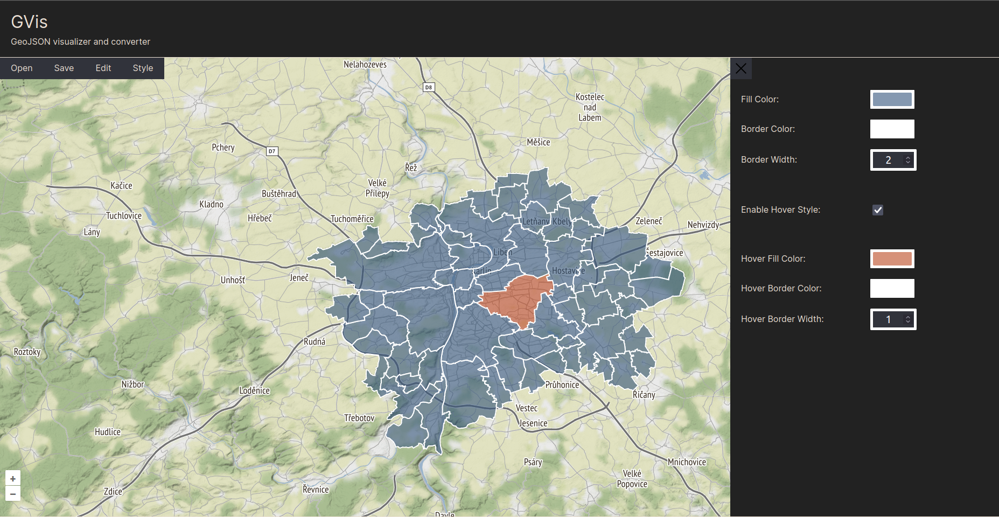

# [GVis](https://jakubpeleska.github.io/GVis/)

- A simple website to visualize GeoData in [GeoJSON](https://geojson.org/) and [WKT format](https://libgeos.org/specifications/wkt/) written in functional [React](https://react.dev/).
- App allows: 
  - Offline upload of data via File Input or Drag and Drop.
  - Data Editing
  - Parametrization of visualization
  - Data download
- Map components are provided by [Pigeon Maps](https://pigeon-maps.js.org/).
- Color picker is provided by [React Color](https://casesandberg.github.io/react-color/).

- For development and build process project uses [Vite](https://vitejs.dev/)

### Quick Start
- You will Node.js and npm to run the app. If you need help with setup take a look [here](https://docs.npmjs.com/downloading-and-installing-node-js-and-npm).
- I also recommend using [nmv](https://github.com/nvm-sh/nvm) for managing the Node.JS versions.
- Example data are [here](./example-data/prague-districts.geojson)

#### Install Commands
- `nvm use`
- if needed also `nvm install v18.16.0`
- `npm install`

#### Run Development
- `npm run dev`

#### Run Build
- `npm run build`

### Deployment
- There is setup automatic deploy to Github pages via GitHub actions on push to Main branch

